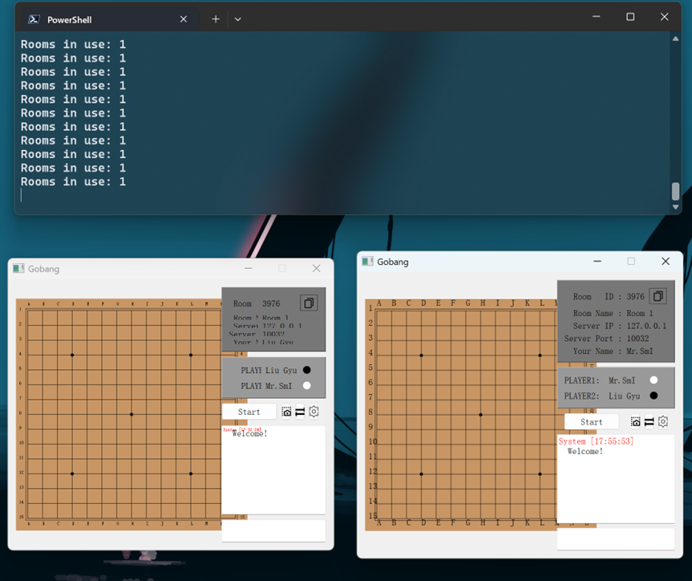
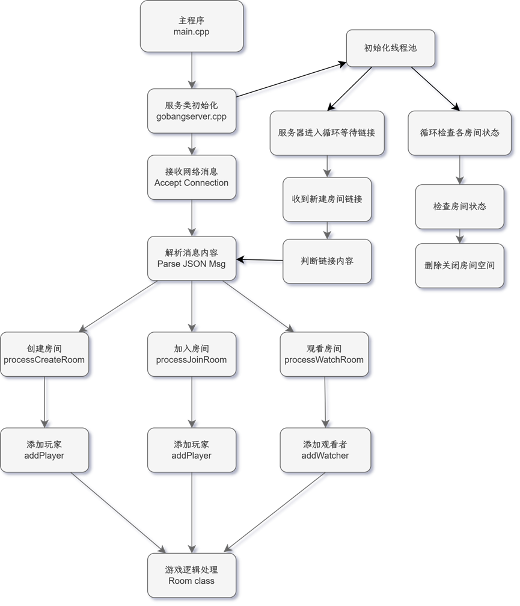
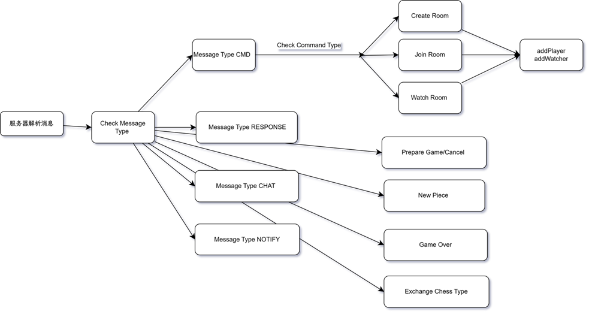
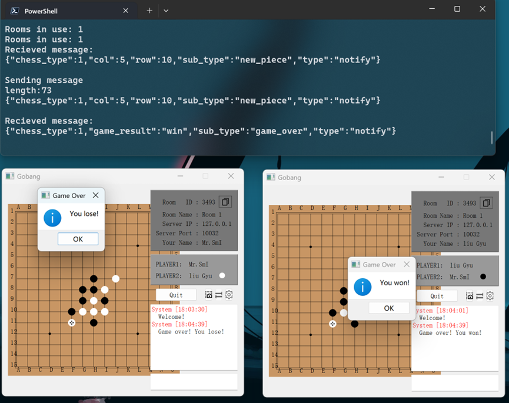
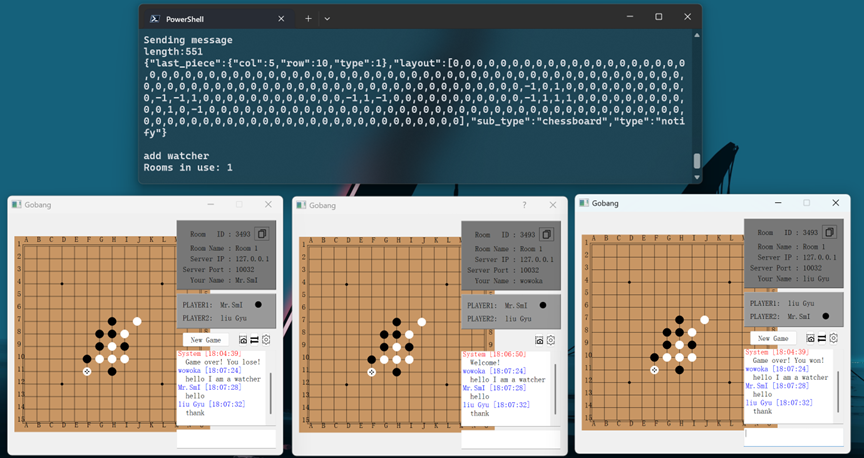

1. 下棋对抗交互：通过QT图形库实现GUI界面，跨平台。两方用户可实时获取棋盘落子信息，下棋与得到反馈。
2. 利用网络实现跨网段对抗：程序分为服务端(GobangServer)与客户端(Gobang)，用户在只需要启动客户端程序，输入正在提供服务的服务端地址，便可以开始游玩。
3. 服务器支持多线程任务执行：本程序可设定实时开启房间数，观战人数。利用线程锁确保线程间在运行时不会修改非本线程数据。
4. 网络数据交换具体流程：服务器开放数据端口并监听数据，接到远程传来的消息就建立socket通道并返回成功链接信息，在收到网络消息（类型为JSON）后解析其需求，如创建房间，调用对应函数创建相应空间，返回成功信息（包含房间ID、对方ID），对抗用户输入对应房间ID后与服务器建立新的socket链接，服务器处理通知，使得房间内所有用户实时了解信息，旁观者可进入指定房间观看下棋过程。所有玩家实时更新棋盘数据，处理流程在本地运行，以便于减轻服务端程序压力。
5. 简单聊天功能：本程序提供实时聊天功能，用户（包括观战用户）可以实现文本的交流
6. 其他个性化功能：更换棋盘背景（自定义背景颜色、图片）、交换黑白棋等等。

